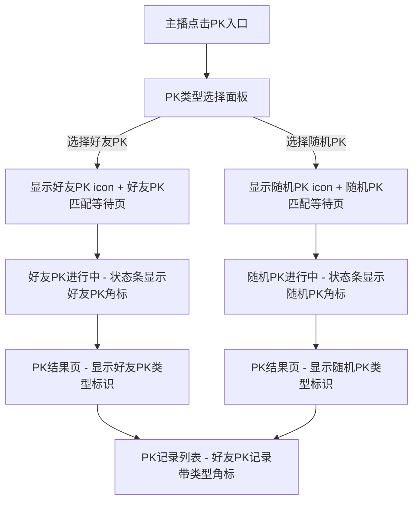

# 直播-PK-好友PK与随机PK图标样式区分260617

> **作者：** 徐雅静 | **版本：** v1.0 | **状态：** 评审中 | **日期：** 2026-06-17  
> **平台：** iOS / Android | **技术方案：** Native | **优先级：** P4 | **预估工期：** 2d  
> **需求来源记录：** [需求池链接](https://uf1iawhques.sg.larksuite.com/record/E7Skrg8xrexk1ecEKaPlNueHg6c)

---

## 一、需求背景

### 1.1 现状与问题

目前好友PK和随机PK在客户端所有展示位置使用完全相同的icon图标，用户和主播无法从icon外观上区分当前PK属于哪种类型。运营侧反馈该问题导致用户对PK模式的感知不清晰，不利于好友PK功能的推广。

### 1.2 目标

> **核心目标：** 通过图标样式差异化，让用户在所有PK相关入口和状态展示中一眼识别好友PK与随机PK。

### 1.3 成功指标

| 指标 | 当前值 | 目标值 | 统计口径 |
|------|--------|--------|----------|
| 好友PK入口点击率 | — | +5% | 埋点 click_friend_pk_entry |
| 用户对PK类型的识别准确率 | — | ≥90% | 用户调研 |

---

## 二、需求说明

### 2.1 功能点：PK类型图标样式区分（FUNC-001）

#### 产品描述

将好友PK和随机PK的图标从当前统一样式改为差异化设计。好友PK图标使用双人对战造型（两个相连的头像轮廓+闪电），整体色调偏暖（橙色系），传达"好友互动"的亲密感；随机PK图标使用骰子/随机元素造型（交叉的闪电+问号），整体色调偏冷（蓝紫色系），传达"随机匹配"的未知感。

#### 交互规则

**图标应用位置清单：**

| 位置编号 | 位置描述 | 当前状态 | 改造说明 |
|----------|----------|----------|----------|
| POS-01 | 主播端直播间底部工具栏 — PK入口按钮 | 统一PK icon | PK入口按钮点击后，弹出PK类型选择面板时，面板内「好友PK」和「随机PK」两个选项使用各自差异化icon |
| POS-02 | PK匹配等待页面 — 顶部标识 | 统一PK icon | 根据当前匹配类型，显示对应icon + 文案"好友PK匹配中"或"随机PK匹配中" |
| POS-03 | PK进行中 — 直播间顶部PK状态条 | 统一PK icon | PK状态条左上角显示当前PK类型的小图标角标（16×16） |
| POS-04 | 观众端直播间 — PK状态标识 | 统一PK icon | 观众进入正在PK的直播间时，PK状态条左上角显示类型角标 |
| POS-05 | PK结果页 — 顶部类型标识 | 无类型标识 | 新增：结果页标题区域显示类型icon + "好友PK"或"随机PK"文案 |
| POS-06 | PK记录列表 — 每条记录的类型标识 | 无类型标识 | 新增：每条PK记录左侧增加类型icon角标（12×12） |

**图标规格：**

| 规格 | 好友PK icon | 随机PK icon |
|------|-------------|-------------|
| 主色 | #FF8A24（暖橙） | #7B2BFF（品牌紫） |
| 辅助色 | #FFD18C（浅橙） | #B794FF（浅紫） |
| 造型 | 双人头像轮廓 + 中间闪电 | 交叉闪电 + 问号元素 |
| 标准尺寸 | 32×32 @2x | 32×32 @2x |
| 小尺寸（角标） | 16×16 @2x / 12×12 @2x | 16×16 @2x / 12×12 @2x |

**适配规则：**
- 深色模式：icon主色不变，辅助色降低20%亮度
- icon资源需提供@2x和@3x两套

#### AI开发规格

```yaml
# 功能标识：FUNC-001

trigger: "所有展示PK类型icon的UI位置"

display:
  icon_asset:
    friend_pk:
      standard: "ic_pk_friend_32"
      badge_16: "ic_pk_friend_badge_16"
      badge_12: "ic_pk_friend_badge_12"
    random_pk:
      standard: "ic_pk_random_32"
      badge_16: "ic_pk_random_badge_16"
      badge_12: "ic_pk_random_badge_12"

behavior:
  on_pk_type_resolved: "根据PK类型字段(pk_type)选择对应icon资源"
  icon_selection_logic: "pk_type == 'friend' → friend_pk资源; pk_type == 'random' → random_pk资源"
  fallback: "pk_type为空或未知类型 → 使用当前默认PK icon（向后兼容）"

data_dependencies:
  - field: pk_type
    source: "PK会话数据，现有字段，无需新增"
    values: "'friend' | 'random'"
```

---

## 三、边界与异常

| ID | 场景 | 条件 | 期望行为 | 必要性 |
|----|------|------|----------|--------|
| EC-001 | PK类型字段缺失 | pk_type为null或空字符串 | 使用当前默认PK icon，不崩溃不报错 | **必须** |
| EC-002 | 新增PK类型 | 未来新增pk_type枚举值（如"team"） | 使用默认PK icon，不因未知类型崩溃 | **必须** |
| EC-003 | icon资源加载失败 | 本地资源丢失或损坏 | 降级为纯文字标签"好友PK"/"随机PK" | **必须** |
| EC-004 | 深色模式适配 | 用户切换深色/浅色模式 | icon颜色自动适配，无需用户操作 | **必须** |
| EC-005 | 低版本客户端 | 用户未更新到包含新icon的版本 | 显示旧版统一PK icon，无影响 | **必须** |

---

## 四、设计稿

### 4.1 交互流程图



### 4.2 关键页面说明

| 页面/状态 | 布局描述 | 关联功能 |
|-----------|----------|----------|
| PK类型选择面板 | 底部弹出面板：两个卡片式选项，左侧好友PK（暖橙icon+文案），右侧随机PK（紫色icon+文案） | FUNC-001 POS-01 |
| 好友PK匹配等待 | 顶部居中显示好友PK icon + "好友PK匹配中..." 文案 + 匹配动画 | FUNC-001 POS-02 |
| 随机PK匹配等待 | 顶部居中显示随机PK icon + "随机PK匹配中..." 文案 + 匹配动画 | FUNC-001 POS-02 |
| PK进行中状态条 | PK状态条左上角增加16×16类型角标icon | FUNC-001 POS-03/04 |
| PK结果页 | 标题区域显示类型icon(32×32) + "好友PK"或"随机PK"文案 | FUNC-001 POS-05 |
| PK记录列表 | 每条记录左侧增加12×12类型icon角标 | FUNC-001 POS-06 |

### 4.3 原型文件

- 可交互 HTML 原型：`output/直播/PK/直播-PK-好友PK与随机PK图标样式区分260617-prototype.html`
- 在浏览器中打开可查看完整交互流程

---

## 五、埋点需求

| 事件名 | 触发时机 | 参数 |
|--------|----------|------|
| pk_type_icon_expose | PK类型icon曝光时 | pk_type: "friend" \| "random", position: POS-01~POS-06 |
| pk_type_select_click | PK类型选择面板点击时 | pk_type: "friend" \| "random" |

---

## 六、验收标准

| 编号 | 验收项 | 关联功能 | 通过标准 |
|------|--------|----------|----------|
| AC-001 | PK类型选择面板icon区分 | FUNC-001 POS-01 | 面板内好友PK显示暖橙双人icon，随机PK显示紫色闪电问号icon |
| AC-002 | 匹配等待页icon区分 | FUNC-001 POS-02 | 好友PK匹配页显示好友PK icon，随机PK匹配页显示随机PK icon |
| AC-003 | PK状态条角标 | FUNC-001 POS-03/04 | PK进行中主播端和观众端状态条左上角均显示正确类型角标 |
| AC-004 | PK结果页类型标识 | FUNC-001 POS-05 | 结果页标题区域显示正确的PK类型icon和文案 |
| AC-005 | PK记录列表角标 | FUNC-001 POS-06 | 记录列表每条记录显示正确的类型角标 |
| AC-006 | 类型缺失降级 | EC-001/002 | pk_type为空或未知值时显示默认PK icon，无崩溃 |
| AC-007 | 深色模式 | EC-004 | 深色模式下icon辅助色正确降低亮度 |
| AC-008 | 双端一致性 | — | iOS和Android显示效果一致 |

---

## 变更记录

| 版本 | 日期 | 作者 | 变更内容 |
|------|------|------|----------|
| v1.0 | 2026-06-17 | 徐雅静 | 初始版本 |
