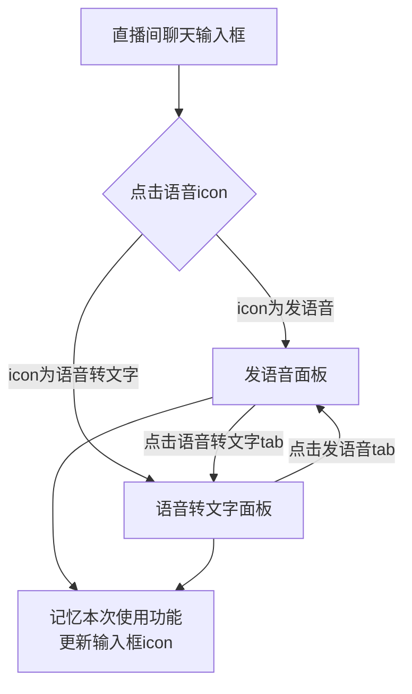
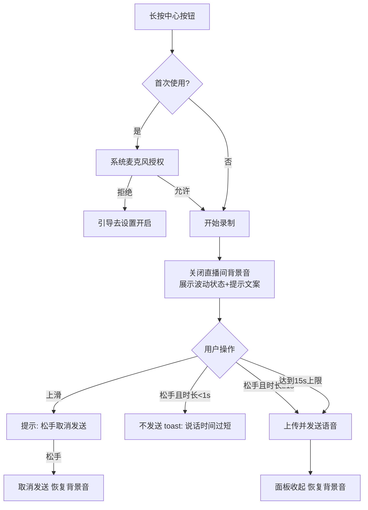
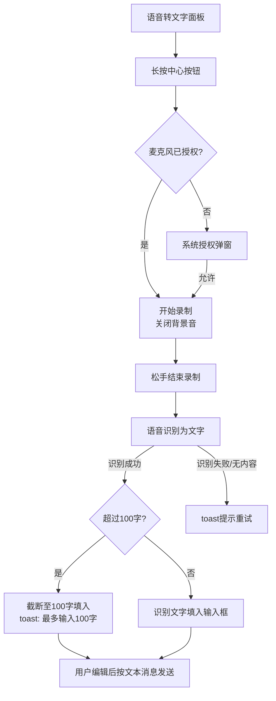

# 直播-消息-直播间发言新增发语音与语音转文字260715

---

## 一、需求背景

### 1.1 现状与问题

当前直播间公聊区仅支持文本、表情包等消息形式，多语言用户之间的沟通效率有限。针对海外直播场景，部分用户更习惯通过语音表达，同时不同国家用户之间存在语言障碍，仅靠文字输入的发言门槛较高，影响直播间互动率。

**需求来源：** [消息-直播间发言-新增发语音&语音转文字功能](https://uf1iawhques.sg.larksuite.com/wiki/T8uhwOwPliLWMVkXk1Hlz88lgKe)（产品侧）

### 1.2 目标

> **核心目标：** 在直播间公聊区新增发语音及语音转文字能力，降低用户发言门槛，增强跨语言交流能力，提升直播间互动率。

### 1.3 关键指标

| 指标 | 当前值 | 目标值 | 统计口径 |
|------|--------|--------|----------|
| 直播间公聊区人均发言条数 | — | 提升 | BI |
| 直播间发言用户渗透率 | — | 提升 | BI |
| 语音消息发送成功率 | — | ≥99% | 服务端统计 |

---

## 二、需求说明

本需求共 6 个功能点：

| 编号 | 功能点 | 处理端 |
|------|--------|--------|
| FUNC-001 | 发语音/语音转文字入口 | 客户端 |
| FUNC-002 | 语音录制交互 | 客户端 |
| FUNC-003 | 语音消息展示与播放 | 客户端+服务端 |
| FUNC-004 | 语音消息翻译 | 客户端+服务端 |
| FUNC-005 | 语音转文字 | 客户端+服务端 |
| FUNC-006 | 语音内容审核 | 服务端 |

### 2.1 功能点 FUNC-001：发语音/语音转文字入口

#### 功能描述

在直播间聊天输入框区域新增「发语音」入口 icon。用户点击后切换至发语音操作界面；界面内提供「发语音」和「语音转文字」两个 tab，用户可自由切换。输入框入口 icon 记忆用户上一次使用的功能，下次进入直播间时默认展示对应 icon。

#### 交互规则

- **入口位置：** `[客户端]` 直播间聊天输入框区域，新增「发语音/语音转文字」icon；默认为「发语音」icon。
- **入口点击：** `[客户端]` 点击 icon，聊天输入框区域切换至对应的语音操作面板（发语音面板或语音转文字面板，取决于当前 icon 状态）。
- **tab 切换：** `[客户端]` 语音操作面板内包含「发语音」「语音转文字」两个 tab；点击「语音转文字」tab，面板切换至语音转文字功能界面，同时聊天输入框的「发语音」icon 切换为「语音转文字」icon；点击「发语音」tab 反之。
- **入口记忆：** `[客户端]` 入口 icon 以用户上一次使用的功能为准，本地持久化存储；用户从未使用过时默认为「发语音」icon。
- **面板收起：** `[客户端]` 点击面板外区域、发送成功、或切换至文本输入时，语音操作面板收起。

#### 异常处理

- **数据为空：** `[客户端]` 无特殊空数据场景；面板首次加载失败时展示重试入口。
- **文本超长：** `[客户端]` tab 文案为固定多语言文案，按控件宽度自适应，超长时尾部截断显示省略号。
- **网络异常：** `[客户端]` 入口展示不依赖网络；无网络时仍可打开面板，录制/发送环节的网络异常见 FUNC-002。
- **重复操作：** `[客户端]` 连续快速点击入口 icon 做防抖处理，300ms 内重复点击不重复触发面板开合动画。

#### 业务流程图

### 2.2 功能点 FUNC-002：语音录制交互

#### 功能描述

用户在发语音面板长按中心按钮录制语音，录制过程中展示动效与声音波动状态，松手发送、上滑取消。录制时长限制 1 秒至 15 秒。录制期间关闭直播间其他背景音，只收录用户麦克风声音。

#### 交互规则

- **麦克风授权：** `[客户端]` 首次长按录制按钮时，触发系统麦克风授权弹窗；用户拒绝授权后再次长按，引导用户前往系统设置开启麦克风权限。
- **开始录制：** `[客户端]` 长按发语音面板中心按钮，开始录制语音；按钮规律展示录制动效。
- **背景音处理：** `[客户端]` 录制期间，直播间其他背景音（主播声音、音效等）关闭，只收录用户麦克风声音；录制结束后背景音恢复原音量。
- **录制中提示：** `[客户端]` 录制期间弹出提示框，根据用户声音大小实时展示语音波动状态，并展示文案「松手发送，上滑取消」。
- **上滑取消：** `[客户端]` 录制中手指上滑至取消区域，提示文案切换为「松手取消发送」；此时松手则取消发送，录音丢弃。
- **松手发送：** `[客户端+服务端]` 录制中直接松手，客户端结束录制并将语音文件上传至服务端发送，语音操作面板收起。
- **时长限制：** `[客户端]` 录制时长最少 1 秒，最多 15 秒；录制时长不足 1 秒时松手，该语音不发送，toast 提示「说话时间过短」。
- **倒计时提示：** `[客户端]` 录制进入最后 5 秒时，提示文案切换为倒计时展示：5、4、3、2、1；达到 15 秒上限时自动结束录制并发送。

#### 异常处理

- **数据为空：** `[客户端]` 录制结果为空文件（如麦克风被其他应用占用导致无声）时，不发送，toast 提示录制失败请重试。
- **文本超长：** `[客户端]` 本功能点无文本输入场景，不涉及。
- **网络异常：** `[客户端+服务端]` 语音上传失败时，toast 提示发送失败，公聊区本地消息展示失败状态并提供点击重发；重发仍使用已录制的本地语音文件。
- **重复操作：** `[客户端]` 录制结束到发送完成期间，录制按钮置为不可用状态，防止重复触发录制；同一条语音重发做防重，服务端以消息唯一 ID 去重。
- **录制中断：** `[客户端]` 录制过程中来电、切后台、直播间被关闭等中断场景，终止录制且不发送，恢复直播间背景音。

#### 业务流程图

### 2.3 功能点 FUNC-003：语音消息展示与播放

#### 功能描述

语音消息发送成功后，在直播间公聊区以「语音条 + 原语种文案」两行结构展示：首行为可点击播放的语音条，第二行为语音内容识别出的原语种文字。所有直播间内用户点击语音条可播放语音，播放期间直播间背景音降低音量。

#### 交互规则

- **展示结构：** `[客户端]` 公聊区语音消息分两行展示——首行：语音条（含时长）；第二行：语音内容对应原语种的文字文案。
- **文案来源：** `[服务端]` 语音发送后，服务端对语音内容进行语音识别（ASR），识别出原语种文字，随消息下发给直播间内所有用户。
- **播放触发：** `[客户端]` 点击公聊区语音条，开始播放该条语音。
- **播放中背景音：** `[客户端]` 语音播放期间，直播间其他背景音降低音量；语音播放终止或播放完成后，直播间背景音量恢复。
- **播放终止与重播：** `[客户端]` 语音播放期间再次点击该语音条，播放终止；终止后再次点击语音条，从头重新播放。
- **互斥播放：** `[客户端]` 同一时间仅允许播放一条语音；播放新语音时，自动终止当前正在播放的语音。

#### 异常处理

- **数据为空：** `[客户端+服务端]` 语音识别结果为空（如无有效人声）时，第二行文案不展示，仅展示语音条。
- **文本超长：** `[客户端]` 识别文案超长时，公聊区按消息气泡最大宽度自动换行完整展示，与现有文本消息规则一致。
- **网络异常：** `[客户端]` 语音文件拉取失败时，toast 提示播放失败，语音条保持可再次点击重试。
- **重复操作：** `[客户端]` 快速连续点击语音条按「播放/终止」状态切换处理，做 300ms 防抖，避免播放状态错乱。

### 2.4 功能点 FUNC-004：语音消息翻译

#### 功能描述

保留公聊区现有翻译功能，并扩展支持语音消息的识别文案。VIP 身份用户点击语音消息的原语种文案，弹出操作卡，点击「翻译」后原语种文案切换为翻译后的文案。

#### 交互规则

- **功能保留：** `[客户端+服务端]` 公聊区原有文本消息翻译功能保持不变。
- **触发条件：** `[客户端]` VIP 身份用户点击语音消息第二行的原语种文案，弹出操作卡（与现有文本消息操作卡一致），操作卡内包含「翻译」按钮。
- **权限校验：** `[客户端+服务端]` 客户端根据用户 VIP 身份控制操作卡翻译入口展示；服务端在翻译请求时二次校验 VIP 身份。
- **翻译展示：** `[客户端+服务端]` 点击「翻译」，服务端将原语种文案翻译为用户设置的目标语种，客户端将该条消息的原语种文案切换为翻译后文案。
- **非 VIP 用户：** `[客户端]` 非 VIP 用户点击文案不展示翻译入口，与现有文本消息翻译的身份规则保持一致。

#### 异常处理

- **数据为空：** `[客户端]` 语音消息无识别文案（第二行未展示）时，无翻译入口。
- **文本超长：** `[客户端]` 翻译后文案超长时按消息气泡最大宽度自动换行完整展示。
- **网络异常：** `[客户端+服务端]` 翻译请求失败时，toast 提示翻译失败，文案保持原语种展示，用户可重新触发翻译。
- **重复操作：** `[客户端]` 翻译请求进行中，操作卡「翻译」按钮置为不可点击，防止重复请求；已翻译的消息再次点击不重复请求翻译。

### 2.5 功能点 FUNC-005：语音转文字

#### 功能描述

用户切换至「语音转文字」tab 后，长按中心按钮说话，语音内容实时识别为对应语种文字并自动填入聊天输入框，用户可编辑后以普通文本消息发送。

#### 交互规则

- **功能入口：** `[客户端]` 在语音操作面板点击「语音转文字」tab，切换至语音转文字功能界面（入口联动规则见 FUNC-001）。
- **麦克风授权：** `[客户端]` 首次长按语音转文字中心按钮时，触发系统麦克风授权弹窗；已在 FUNC-002 授权过则不重复弹出。
- **开始录制：** `[客户端]` 长按语音转文字中心按钮，开始录制语音；按钮规律展示录制动效。
- **背景音处理：** `[客户端]` 录制期间，直播间其他背景音关闭，只收录用户麦克风声音；录制结束后恢复原音量。
- **识别与填入：** `[客户端+服务端]` 语音内容识别为对应语种的文字，自动填入聊天输入框；用户可对识别结果进行编辑、删除，然后按现有文本消息流程发送。
- **字数上限：** `[客户端]` 识别文字填入后若超过输入框字数上限，截断至 100 字填入，并 toast 提示「最多输入100字」。

#### 异常处理

- **数据为空：** `[客户端]` 语音未识别出有效文字时，输入框不填入内容，toast 提示未识别到内容请重试。
- **文本超长：** `[客户端]` 识别结果超过 100 字时截断填入并 toast 提示「最多输入100字」。
- **网络异常：** `[客户端+服务端]` 识别请求失败时，toast 提示识别失败请重试，输入框内容不变。
- **重复操作：** `[客户端]` 识别请求进行中，中心按钮置为不可用，防止重复触发录制。
- **录制中断：** `[客户端]` 录制过程中来电、切后台等中断场景，终止录制，已识别部分不填入输入框，恢复直播间背景音。

#### 业务流程图

### 2.6 功能点 FUNC-006：语音内容审核

#### 功能描述

语音消息及其识别文案在下发到直播间前接入内容审核，拦截违规内容，保障直播间内容安全。

#### 交互规则

- **审核对象：** `[服务端]` 语音消息的音频文件及其 ASR 识别文案均接入内容审核；语音转文字填入输入框后发送的文本，走现有文本消息审核链路。
- **审核时机：** `[服务端]` 用户发送语音后，服务端先完成审核再下发至直播间公聊区。
- **审核通过：** `[服务端]` 审核通过的语音消息正常下发直播间内所有用户。
- **审核不通过：** `[客户端+服务端]` 审核不通过的语音消息不对其他用户下发；发送者侧的展示与提示规则与现有文本消息违规处理规则保持一致。
- **违规处置：** `[服务端]` 违规内容按平台现有违规处置规则处理（记录、警告、禁言等），与现有公聊消息处置链路一致。

#### 异常处理

- **数据为空：** `[服务端]` 音频文件损坏或为空导致无法审核时，判定发送失败，客户端展示发送失败状态。
- **文本超长：** `[服务端]` 识别文案长度在 ASR 环节已受录音时长约束（最长 15 秒），无额外超长场景。
- **网络异常：** `[服务端]` 审核服务超时或异常时的兜底策略（先发后审/先审后发降级）由技术侧评估确定，需保证不阻塞直播间正常消息流。
- **重复操作：** `[服务端]` 同一条消息仅审核一次，以消息唯一 ID 去重。

---

## 三、设计稿

> 设计稿完成后在此补充链接。

---

## 四、多语言Key

| 是否APP端 | Key | 中文 |
|-----------|-----|------|
| 是 | live_voice_msg_tab_voice | 发语音 |
| 是 | live_voice_msg_tab_voice_to_text | 语音转文字 |
| 是 | live_voice_msg_release_to_send | 松手发送，上滑取消 |
| 是 | live_voice_msg_release_to_cancel | 松手取消发送 |
| 是 | live_voice_msg_too_short | 说话时间过短 |
| 是 | live_voice_msg_max_100_chars | 最多输入100字 |
| 是 | live_voice_msg_send_failed | 发送失败，请重试 |
| 是 | live_voice_msg_play_failed | 播放失败，请重试 |
| 是 | live_voice_msg_recognize_failed | 未识别到内容，请重试 |
| 是 | live_voice_msg_mic_permission_tip | 请在系统设置中开启麦克风权限 |
