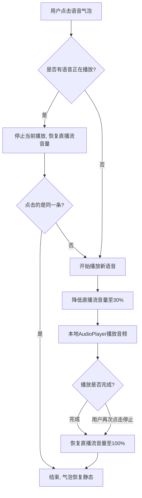
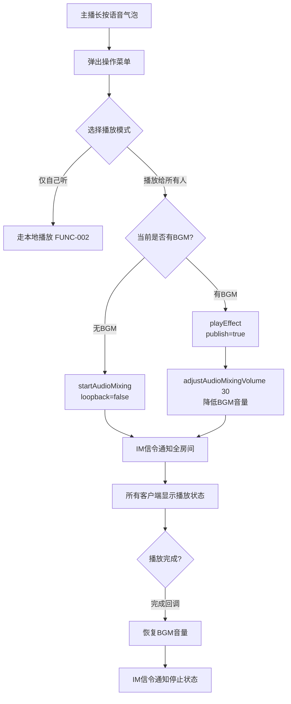

# 直播-消息-直播间语音消息播放音频控制方案260716

> **作者：** 徐雅静 | **版本：** v1.0 | **状态：** 草稿 | **日期：** 2026-07-16
> **平台：** iOS / Android | **技术方案：** Native（声网 Agora RTC SDK） | **优先级：** P2

---

## 一、需求背景

### 1.1 现状与问题

当前直播间仅支持文字弹幕互动，观众无法发送语音消息。引入语音消息后，直播间将同时存在多个音源（主播麦克风、连麦用户麦克风、BGM、礼物音效、语音消息），如何在播放语音消息时合理控制各音源的音量和收音，避免回声、串音和体验劣化，是核心技术产品挑战。

竞品参考：抖音、快手、BIGO Live 均采用"纯本地播放"作为语音消息的默认方案，即点击语音条后仅点击者自己能听到，不影响房间其他人。

### 1.2 目标

> **核心目标：** 在直播间多音源场景下，实现语音消息的录制、发送和播放功能，确保各角色（观众、上麦用户、主播）在播放语音消息时不产生回声或串音，且直播核心音频体验不受影响。

### 1.3 关键指标

| 指标 | 当前值 | 目标值 | 统计口径 |
|------|--------|--------|----------|
| 语音消息发送渗透率 | — | ≥5% | 发送语音消息用户数 / 进入直播间用户数 |
| 语音消息播放完成率 | — | ≥80% | 完整播放次数 / 点击播放次数 |
| 语音播放期间音频投诉率 | — | <0.1% | 播放语音消息期间回声/杂音投诉 / 语音消息总播放次数 |

---

## 二、需求说明

### 2.1 功能点：语音消息录制与发送（FUNC-001）

#### 功能描述

观众、上麦用户、主播均可在直播间录制并发送语音消息。录制交互为长按录音按钮开始录制，松手发送；录制过程中上滑可取消。发送后语音消息以语音气泡形式显示在公屏弹幕区。

#### 交互规则

- **入口位置：** `[客户端]` 直播间底部输入栏右侧新增语音按钮（icon），点击切换至语音输入模式
- **录制触发：** `[客户端]` 长按语音按钮开始录制，最短录音时长 1 秒，最短以下松手提示"录制时间太短"；最长录音时长 60 秒，到达上限自动停止录制并发送
- **取消操作：** `[客户端]` 录制中上滑超过 50px 进入"松手取消"区域，松手后取消本次录制，不发送
- **录制状态展示：** `[客户端]` 录制中展示录音波形动画 + 录制时长计时器（精确到秒）
- **发送流程：** `[客户端+服务端]` 录制完成后客户端将音频文件上传至服务端文件存储，服务端返回音频 URL 和时长信息，通过 IM 长连接广播给房间内所有用户
- **音频格式：** `[客户端]` 录制格式为 AAC，采样率 16kHz，单声道，码率 32kbps
- **权限控制：** `[服务端]` 被禁言用户不可发送语音消息，客户端点击录音按钮时 Toast 提示"您已被禁言"

#### 异常处理

- **麦克风权限未授权：** `[客户端]` 首次点击语音按钮时弹出系统麦克风权限请求；用户拒绝后点击语音按钮 Toast 提示"请在系统设置中开启麦克风权限"
- **录制时长不足：** `[客户端]` 长按不足 1 秒松手，Toast 提示"录制时间太短"，不发送
- **网络异常：** `[客户端]` 音频上传失败时 Toast 提示"发送失败，请重试"，语音气泡显示失败状态，点击可重新上传
- **重复操作：** `[客户端]` 正在上传中再次录制新语音消息，排队等待上一条上传完成后自动发送；同一时刻仅允许一条语音消息处于录制状态

---

### 2.2 功能点：语音消息公屏展示与本地播放（FUNC-002）

#### 功能描述

语音消息发送成功后，在公屏弹幕区以语音气泡形式展示。所有用户均可点击语音气泡播放语音消息，播放采用**纯本地播放**模式，仅点击者自己能听到，不影响房间内其他用户。播放期间自动降低直播音频流音量（Audio Ducking），保证语音消息可清晰收听。

#### 交互规则

- **气泡样式：** `[客户端]` 语音气泡包含用户昵称 + 语音波形图标 + 时长文案（如"0:05"），气泡宽度根据时长动态调整（最短 80px，最长 200px）
- **播放触发：** `[客户端]` 点击语音气泡开始播放，气泡内波形图标变为播放动画（三道竖线依次闪烁）
- **互斥播放：** `[客户端]` 同一时间仅允许播放一条语音消息，点击新的语音气泡时自动停止上一条的播放
- **播放音频来源：** `[客户端]` 从服务端 CDN 拉取音频文件，使用系统原生 AudioPlayer 本地播放，不经过声网 RTC 通道
- **Audio Ducking 策略：** `[客户端]` 播放语音消息前调用声网 SDK `adjustPlaybackSignalVolume(30)` 将直播流音量降至 30%；播放结束或手动停止后调用 `adjustPlaybackSignalVolume(100)` 恢复原音量
- **播放完成：** `[客户端]` 音频播放完毕后气泡内播放动画停止，恢复静态波形图标，直播流音量恢复
- **手动停止：** `[客户端]` 再次点击正在播放的语音气泡可停止播放
- **听筒/扬声器切换：** `[客户端]` 默认通过扬声器播放；手机贴近耳朵时自动切换至听筒模式（利用距离传感器）

#### 异常处理

- **音频文件加载失败：** `[客户端]` 点击后 1 秒内未开始播放，Toast 提示"语音加载失败"，气泡恢复初始状态
- **气泡超出公屏可视区域：** `[客户端]` 公屏滚动后语音气泡被滚出屏幕，正在播放的语音消息继续播放，直到播放完毕自动停止
- **网络异常：** `[客户端]` 音频文件 CDN 拉取失败时，Toast 提示"网络异常，请重试"
- **音频播放冲突：** `[客户端]` 若设备正在播放其他应用音频（如音乐播放器），语音消息播放时通过 AudioSession（iOS）/ AudioFocus（Android）申请短暂焦点，其他应用音频 ducking 降低音量

#### 业务流程图

---

### 2.3 功能点：主播全房间语音消息广播（FUNC-003）

#### 功能描述

主播拥有将语音消息播放给房间内所有人听的专属能力。主播长按公屏语音气泡后，弹出操作菜单，可选择"播放给所有人"。播放时通过声网 RTC SDK 的音频通道将语音消息推送至远端，连麦用户和观众均可听到。根据当前是否有 BGM 播放中，自动选择不同的声网 API 通道以避免冲突。

#### 交互规则

- **入口：** `[客户端]` 仅主播角色可见。主播长按公屏语音气泡，弹出操作菜单，包含"播放给所有人"和"仅自己听"两个选项
- **通道选择策略：** `[客户端]` 系统自动判断当前是否有 BGM 正在播放：
  - **无 BGM：** 使用 `startAudioMixing(filePath, loopback=false, cycle=1)` 播放，音频通过 RTC 混音通道推送给所有人
  - **有 BGM：** 使用 `playEffect(soundId, filePath, loopCount=0, pitch=1.0, pan=0, gain=80, publish=true)` 播放，语音消息走独立音效通道，BGM 不中断
- **音量控制（无 BGM 模式）：** `[客户端]` 播放前调用 `adjustAudioMixingPublishVolume(80)` 设置远端音量为 80%，调用 `adjustAudioMixingPlayoutVolume(80)` 设置本地音量为 80%
- **BGM 降低（有 BGM 模式）：** `[客户端]` 播放语音消息前调用 `adjustAudioMixingVolume(30)` 将 BGM 音量降至 30%；语音消息播放完毕后调用 `adjustAudioMixingVolume(100)` 恢复 BGM 音量
- **主播麦克风不受影响：** `[客户端]` 无论使用哪种通道，音频均在声网 SDK 引擎内部混音，不经过扬声器→麦克风链路，主播可以边播放语音消息边正常说话
- **播放状态同步：** `[客户端+服务端]` 主播端发起全房间播放后，通过 IM 信令通知所有客户端，其他用户端公屏对应的语音气泡显示"主播正在播放"状态动画
- **互斥规则：** `[客户端]` 同一时刻仅允许一条语音消息进行全房间广播；主播点击播放新语音时，上一条自动停止
- **播放完成回调：** `[客户端]` 监听声网 SDK `onAudioMixingStateChanged`（无 BGM 模式）或 `onAudioEffectFinished`（有 BGM 模式）回调，播放完毕后恢复 BGM 音量并通知其他客户端停止播放状态动画

#### 各角色听感说明

| 角色 | 听到的内容 | 麦克风影响 |
|------|-----------|-----------|
| 主播 | 语音消息 + 自己麦克风音频（本地回放） | 无影响，SDK 内部混音 |
| 连麦用户 | 语音消息 + 主播声音（通过 RTC 下发） | 无影响，作为接收方 |
| 观众（CDN 拉流） | 语音消息 + 主播声音（混合后的流） | 无麦克风 |

#### 异常处理

- **音频文件加载失败：** `[客户端]` 声网 API 调用失败时，Toast 提示"播放失败，请重试"，降级为本地播放模式（FUNC-002）
- **BGM 状态判断异常：** `[客户端]` 无法确认 BGM 是否播放中时，默认走 playEffect 通道（更安全，不会中断可能存在的 BGM）
- **连麦用户中途上麦：** `[客户端]` 全房间广播进行中，新上麦的用户加入 RTC 通道后可自动听到正在播放的语音消息
- **网络异常：** `[客户端]` RTC 推流中断时，语音消息播放同步中断，恢复 BGM 音量

#### 业务流程图

---

### 2.4 功能点：音频优先级模型（FUNC-004）

#### 功能描述

直播间同时存在多个音源（麦克风、BGM、礼物音效、语音消息、系统提示音），需要建立统一的音频优先级模型，确保各音源播放时的音量关系合理、不互相干扰。当高优先级音源播放时，低优先级音源自动降低音量（ducking）或排队等待。

#### 交互规则

- **优先级定义：** `[客户端]` 各音源优先级从高到低：

| 优先级 | 音源 | 策略 |
|--------|------|------|
| P0（不可压） | 主播/连麦用户麦克风实时语音 | 永不被静音或降低音量 |
| P1（临时前景） | 语音消息播放（本地或全房间） | 播放时 ducking 降低 P2/P3 音量 |
| P2（可 duck） | BGM / 背景音乐 | 被 P1 ducking 至 20-30% 音量 |
| P3（可 duck / 排队） | 礼物音效 / 系统提示音 | 被 P1 ducking 至 20-30% 音量；多个 P3 音效排队顺序播放 |

- **Ducking 参数：** `[客户端]` 语音消息开始播放时，P2/P3 音源音量在 200ms 内平滑过渡至目标值（避免突变造成的听感不适）；语音消息播放结束后，500ms 内平滑恢复原音量
- **P3 排队规则：** `[客户端]` 同时触发多个礼物音效时，按触发时间排队播放，队列最大长度 5 个，超出丢弃最早的
- **P1 与 P1 互斥：** `[客户端]` 同一时刻仅允许一条语音消息播放，新语音消息自动停止旧语音消息（见 FUNC-002 互斥规则）

#### 异常处理

- **多音源同时触发：** `[客户端]` 语音消息播放 + 礼物音效同时到达时，语音消息优先播放，礼物音效 ducking 至 20% 音量
- **ducking 后音量未恢复：** `[客户端]` 语音消息播放异常中断（如 crash、切后台）时，通过播放状态监控定时器（每 500ms 检查一次），发现播放已停止但音量未恢复时自动恢复

---

### 2.5 功能点：上麦用户收音保护（FUNC-005）

#### 功能描述

上麦用户（包括主播）在直播间播放语音消息时，如果使用外放模式（未佩戴耳机），语音消息通过扬声器播放的声音可能被麦克风采集并推入 RTC 通道，导致其他用户听到回声或杂音。需要通过耳机检测和提示机制保护上麦用户的收音质量。

#### 交互规则

- **耳机状态检测：** `[客户端]` 上麦用户点击语音气泡播放时，检测当前是否佩戴有线耳机或蓝牙耳机
- **佩戴耳机场景：** `[客户端]` 正常播放语音消息，无需额外处理。耳机隔离声音不会被麦克风采集
- **未佩戴耳机（本地播放模式）：** `[客户端]` 播放前弹出 Toast 提示"建议佩戴耳机播放，避免影响直播间音质"，用户可选择继续播放或取消。若继续播放：
  - 播放音量自动降低至 50%（降低被麦克风采集的风险）
  - 依赖声网 SDK 内置 AEC（回声消除）处理残留的采集信号
- **未佩戴耳机（全房间广播模式 FUNC-003）：** `[客户端]` 无需担心，因为音频通过声网 SDK 的 AudioMixing / playEffect 通道内部混音，不经过扬声器→麦克风链路
- **耳机插拔状态变化：** `[客户端]` 语音消息播放过程中拔出耳机，自动暂停播放，Toast 提示"耳机已断开，建议佩戴耳机后继续播放"
- **仅对上麦用户生效：** `[客户端]` 纯观众角色（未上麦）无麦克风采集，播放语音消息时不需要耳机检测和提示

#### 异常处理

- **蓝牙耳机连接不稳定：** `[客户端]` 蓝牙耳机断连后重连，如果语音消息已暂停，恢复播放
- **耳机状态检测失败：** `[客户端]` 无法判断耳机状态时，默认按"未佩戴耳机"逻辑处理（偏保守）

---

## 三、设计稿

> 设计稿完成后在此补充链接。

---

## 四、多语言 Key

| 是否APP端 | Key | 中文 |
|-----------|-----|------|
| 是 | live_voice_msg_btn | 语音 |
| 是 | live_voice_msg_recording | 松开发送，上滑取消 |
| 是 | live_voice_msg_cancel | 松手取消 |
| 是 | live_voice_msg_too_short | 录制时间太短 |
| 是 | live_voice_msg_send_fail | 发送失败，请重试 |
| 是 | live_voice_msg_load_fail | 语音加载失败 |
| 是 | live_voice_msg_play_all | 播放给所有人 |
| 是 | live_voice_msg_play_self | 仅自己听 |
| 是 | live_voice_msg_playing | 主播正在播放 |
| 是 | live_voice_msg_play_fail | 播放失败，请重试 |
| 是 | live_voice_msg_headphone_tip | 建议佩戴耳机播放，避免影响直播间音质 |
| 是 | live_voice_msg_headphone_disconnected | 耳机已断开，建议佩戴耳机后继续播放 |
| 是 | live_voice_msg_muted | 您已被禁言 |
| 是 | live_voice_msg_network_error | 网络异常，请重试 |
| 是 | live_voice_msg_duration | %d" |
| 是 | live_voice_msg_new_messages | %d New Messages |

---

## 变更记录

| 版本 | 日期 | 作者 | 变更内容 |
|------|------|------|----------|
| v1.0 | 2026-07-16 | 徐雅静 | 初始版本 |
