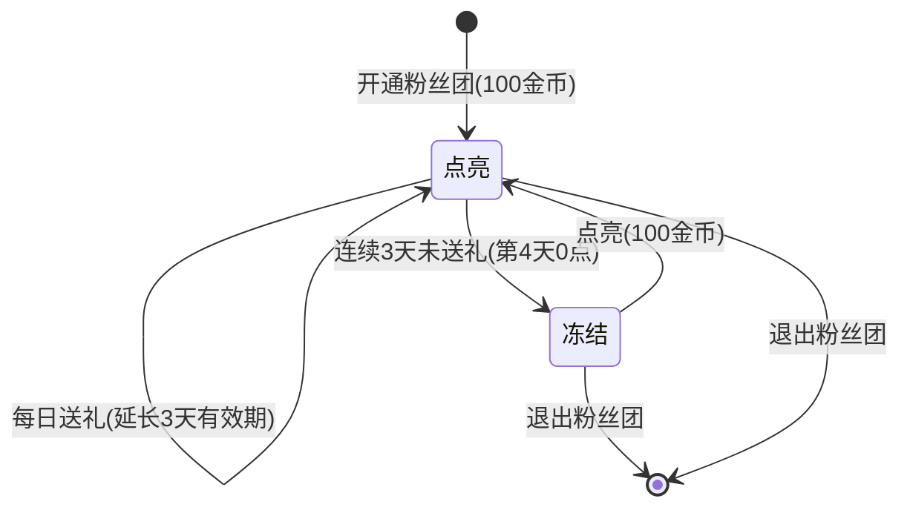

# 直播-粉丝团-粉丝团功能全量需求整合260707

## 一、需求背景

### 1.1 现状与问题

粉丝团是直播业务中连接主播与核心粉丝的关键功能模块，经过多次迭代已形成包含开通加入、亲密度任务、等级权益、冻结点亮、公告通知、数据统计等完整功能体系。目前各功能散落在多份历史需求文档中，缺乏一份统一的全量规格文档，不利于新成员理解全貌、技术侧维护以及后续迭代参考。

本文档将粉丝团模块的全部功能点整合为一份完整 PRD，作为粉丝团模块的基准参考文档。

**需求来源：** [粉丝团优化/修改 知识库文档集](https://uf1iawhques.sg.larksuite.com/wiki/KzKAwyFPiieYpYkilOwlobVygEc)

### 1.2 目标

> **核心目标：** 将粉丝团模块全部功能以统一格式整合为一份完整 PRD，覆盖开通、亲密度、等级权益、冻结点亮、退出、公告、通知、列表、分成、直播间交互、数据后台、礼物后台共 13 个功能点。

### 1.3 关键指标

| 指标 | 当前值 | 目标值 | 统计口径 |
|------|--------|--------|----------|
| 粉丝团开通转化率 | — | 持续提升 | BI |
| 粉丝团活跃率（点亮/冻结比） | — | 提升点亮占比 | BI |
| 粉丝团用户送礼 ARPU | — | 稳步增长 | BI |

---

## 二、需求说明

### FUNC-001 功能点：粉丝团开通与加入

#### 功能描述

用户在直播间内通过粉丝团入口花费 100 金币开通某主播的粉丝团，成为该主播的粉丝团成员。开通后自动佩戴粉丝团勋章，获得 Lv.1 等级，进入「点亮」状态，享有对应等级权益。

#### 交互规则

- **开通费用：** `[服务端]` 开通粉丝团固定费用 100 金币，由服务端扣费
- **开通入口：** `[客户端]` 直播间内粉丝团卡片上的「加入粉丝团」按钮；粉丝团贴纸引导入口
- **开通流程：** `[客户端+服务端]` 用户点击「加入」→ 客户端展示确认弹窗（含费用说明）→ 用户确认 → 服务端扣费并创建粉丝团关系 → 客户端刷新粉丝团卡片为「点亮」状态
- **勋章自动佩戴：** `[服务端]` 开通后服务端自动设置为佩戴状态，无需用户手动操作；去除「固定佩戴」功能
- **默认粉丝团昵称：** `[服务端]` 主播未设置粉丝团昵称时，默认名称为"Fans"，不影响用户开通和佩戴
- **自动关注主播：** `[服务端]` 未关注主播的用户通过任意入口加入粉丝团时，自动给用户关注该主播
- **开通有效期：** `[服务端]` 开通后有效期为 3 天（如 1 号开通，1/2/3/4 号生效，5 号 0 点冻结）；每日送礼则延长 3 天有效期（当日送多次不叠加）
- **亲密度增加：** `[服务端]` 开通粉丝团增加 1 亲密度，当日开通/点亮任务亲密度上限 5
- **分成处理：** `[服务端]` 开通费用主播获得 50% 分成，代理不参与分成

#### 异常处理

- **金币不足：** `[客户端]` 用户金币不足时，点击开通按钮唤起充值页面
- **重复开通：** `[客户端+服务端]` 已加入粉丝团的用户不展示开通按钮，服务端做防重校验
- **网络异常：** `[客户端]` 扣费请求失败时 Toast 提示"网络异常，请重试"，不进行扣费
- **主播封禁/注销：** `[服务端]` 主播账号异常时，拒绝开通请求

---

### FUNC-002 功能点：亲密度任务体系

#### 功能描述

粉丝团成员通过完成每日任务积累亲密度，亲密度决定粉丝团等级的升降。任务包括送灯牌礼物、送幸运礼物、给主播送礼、开通/点亮粉丝团、开通守护、观看直播、分享直播间共 7 类任务。任务列表由服务端配置，客户端动态展示。

#### 交互规则

- **任务列表展示：** `[客户端]` 粉丝团卡片下方展示亲密度任务面板，任务主标题/副标题由服务端下发
- **任务类型与上限：** `[服务端]` 各任务每日亲密度上限如下：

| 任务类型 | 亲密度规则 | 每日上限 |
|----------|-----------|----------|
| 送粉丝灯牌 | 按送出数量计 | Max 10 |
| 送幸运礼物 | 每 2000 金币 = 1 亲密度（不计入送礼任务进度） | Max 5 |
| 给主播送礼（不含幸运礼物） | 1000 金币 = 1 亲密度，不足 1000 按比例折算（如 500 金币 = 0.5 亲密度） | 按用户等级浮动（见下表） |
| 开通/点亮粉丝团 | 开通 +1，点亮 +2 | Max 5 |
| 开通守护 | 白银 +15，黄金 +30，王者 +1500 | Max 1800 |
| 观看直播 | 每 2 分钟 +1 亲密度（需累计观看 20 分钟） | Max 10 |
| 分享直播间 | 每次 +1 亲密度 | Max 1 |

- **送礼任务每日亲密度上限（按用户等级）：** `[服务端]` 1000 金币 = 1 亲密度的送礼任务上限，由用户当前粉丝团等级决定：

| 等级 | 总亲密度阈值 | 送礼任务日上限 |
|------|------------|--------------|
| Lv.1 | 0 | 70 |
| Lv.2 | 30 | 70 |
| Lv.3 | 60 | 70 |
| Lv.4 | 120 | 70 |
| Lv.5 | 180 | 70 |
| Lv.6 | 250 | 90 |
| Lv.7 | 350 | 120 |
| Lv.8 | 600 | 150 |
| Lv.9 | 900 | 150 |
| Lv.10 | 1,300 | 250 |
| Lv.11 | 2,800 | 400 |
| Lv.12 | 4,800 | 450 |
| Lv.13 | 7,300 | 500 |
| Lv.14 | 10,500 | 600 |
| Lv.15 | 14,500 | 1,000 |
| Lv.16 | 38,000 | 2,500 |
| Lv.17 | 64,000 | 2,500 |
| Lv.18 | 90,000 | 2,500 |
| Lv.19 | 115,000 | 2,500 |
| Lv.20 | 162,500 | 3,000 |

- **守护加成：** `[服务端]` 守护身份对送礼任务亲密度上限有加成：白银 +10%、黄金 +20%、王者 +50%。例：Lv.1 用户（上限 70）开通白银守护，送礼任务上限变为 77

- **任务完成状态展示：** `[客户端]` 已完成的任务右侧展示获得的亲密度数字；已完成任务标题置灰，排序移至任务列表底部
- **送礼按钮唤起面板：** `[客户端]` 点击送礼任务的「送礼」按钮 → 关闭粉丝团卡片 → 唤起礼物面板；点击「送幸运礼物」任务 → 唤起礼物面板并定位至幸运礼物 Tab；若用户不在主播直播间点击送礼，Toast 提示"请前往直播间送礼"
- **观看/分享按钮：** `[客户端]` 观看/分享按钮由服务端控制展示；仅当用户在该主播直播间时才展示，点击后收起粉丝团卡片；分享按钮点击后弹出分享面板
- **冻结状态限制：** `[客户端]` 冻结状态下任务面板整体置灰，不展示任务内容，显示提示文案："因3天未参与给主播送礼，粉丝团勋章已冻结"
- **日亲密度展示：** `[客户端]` 用户粉丝团页面展示当日已获得的亲密度值
- **任务配置能力：** `[服务端]` 任务列表支持服务端动态配置，客户端根据下发数据渲染

#### 异常处理

- **数据为空：** `[客户端]` 服务端未下发任务配置时，任务面板展示空状态提示"暂无任务"
- **文本超长：** `[客户端]` 任务标题/副标题超出一行时末尾截断显示"..."
- **网络异常：** `[客户端]` 任务列表加载失败时展示重试按钮
- **重复操作：** `[客户端]` 任务完成状态实时刷新，按钮点击后做防抖处理

---

### FUNC-003 功能点：等级与权益体系

#### 功能描述

粉丝团共分 Lv.1 至 Lv.20 共 20 个等级，用户通过积累亲密度升级。不同等级解锁不同权益，包括勋章样式升级、灯牌、升级飘屏、专属礼物、进场动效、连麦头像框、升级跑道、送礼跑道等。用户可通过粉丝团卡片内的「成长历程」入口查看当前等级权益和成长数据。

#### 交互规则

- **等级权益列表：** `[H5]` 成长历程为 H5 页面，展示用户数据和当前等级已解锁权益

| 等级 | 权益 | 展示范围 |
|------|------|----------|
| Lv.1 | 粉丝团勋章 | 全局 |
| Lv.1 | 粉丝团灯牌 | 全局 |
| Lv.1 | 粉丝团升级飘屏 | 本直播间 |
| Lv.7 | 专属礼物（初心之光） | 礼物面板 |
| Lv.8 | 新等级粉丝勋章样式升级 | 全局 |
| Lv.10 | 粉丝团升级飘屏 | 区域直播间 |
| Lv.11 | 粉丝团进场动效（直播间人数 < 1000） | 本直播间 |
| Lv.12 | 新等级粉丝勋章样式升级 | 全局 |
| Lv.12 | 专属礼物（心愿宝石） | 礼物面板 |
| Lv.12 | 专属连麦头像框（连麦自动佩戴） | 本直播间 |
| Lv.13 | 粉丝团升级动效 | 本直播间 |
| Lv.13 | 粉丝团升级跑道 | 全站 |
| Lv.16 | 新等级粉丝勋章样式升级 | 全局 |
| Lv.16 | 专属送礼跑道（送礼自动展示） | 本直播间 |
| Lv.20 | 新等级粉丝勋章样式升级 | 全局 |
| Lv.20 | 专属礼物（永恒之心） | 礼物面板 |
| Lv.20 | 粉丝团进场特效升级 | 本直播间 |

- **进场特效优先级：** `[客户端]` 多个进场特效同时存在时，按以下优先级展示：神秘人 > 守护 > Top3 > 游戏Max > VIP > 粉丝团 > 普通用户
- **进场动效触发条件：** `[客户端]` Lv.11 初级进场动效仅在直播间人数 < 1000 时展示；Lv.20 高级进场特效在本直播间展示
- **成长历程数据展示：** `[H5]` 展示三项用户数据：加团天数、今日亲密度、总亲密度
- **满级展示优化：** `[客户端]` 用户达到 Lv.20 满级时，等级进度条显示满级状态，不再展示"升级还需亲密度"
- **升级动效触发：** `[客户端+服务端]` 用户粉丝团等级升到 13 级（含）以上时，每次升级在主播直播间触发升级动效（所有用户可见）。触发等级由系统参数 `fans_upgrade_special_effects`（默认 13）控制。动效展示：左侧主播昵称、右侧成员昵称、中间粉丝团名和升级等级
- **升级飘屏通知：** `[服务端]` Lv.8 起每次升级触发本直播间飘屏（二级透明飘屏，文案："粉丝团：恭喜{nickname}粉丝团到达level.{num}"）；飘屏等级由系统参数 `fans_bullet_level`（默认 8）控制
- **升级跑道通知：** `[服务端]` Lv.16 起每次升级触发区域直播间跑道（一级紫色跑道，文案："恭喜{hostname}的粉丝团成员{nickname}等级到达level.{num}"）；跑道等级由 `fans_road_effect_level`（默认 16）控制

#### 异常处理

- **数据为空：** `[H5]` 成长历程页面数据加载失败时展示空状态页
- **文本超长：** `[客户端]` 权益名称超出显示区域时截断显示
- **网络异常：** `[H5]` H5 页面加载失败时展示"加载失败，点击重试"
- **重复操作：** `[客户端]` 进场动效播放期间不重复触发

---

### FUNC-004 功能点：冻结与点亮机制

#### 功能描述

粉丝团取消续费制，改为点亮制。用户加入粉丝团后只有「点亮」和「冻结」两种状态。连续 3 天未给主播送礼的成员，第 4 天 0 点自动进入冻结状态，勋章置灰、等级特权停用、亲密度停止增长。冻结用户可花费 100 金币重新点亮粉丝团，恢复所有权益。

#### 交互规则

- **冻结触发条件：** `[服务端]` 连续 3 天未给主播送礼，第 4 天 0 点自动冻结
- **点亮有效期延长：** `[服务端]` 每日送礼则有效期延长 3 天（当日送多次不叠加）
- **冻结状态——直播间/Party房：** `[客户端]` 粉丝团 icon 置灰，保留等级数字展示
- **冻结状态——公聊区发言：** `[客户端]` 用户自己视角粉丝团勋章置灰；主播/其他用户视角看不见该用户粉丝勋章
- **冻结状态——群聊：** `[客户端]` 同直播间逻辑，自己视角置灰，他人视角不可见
- **冻结状态——在线观众列表/用户卡片/守护列表：** `[客户端]` 粉丝团冻结显示置灰图标，不区分主播/用户视角
- **冻结状态——粉丝团卡片：** `[客户端]` 等级进度条置灰；亲密度任务面板置灰不展示任务内容；展示提示文案和「点亮」按钮
- **点亮操作：** `[客户端+服务端]` 用户点击「点亮」→ 二级弹窗确认"花费100金币重新点亮粉丝团"→ 确认扣费 → 恢复点亮状态，卡片恢复正常样式
- **点亮亲密度：** `[服务端]` 点亮操作增加 2 亲密度
- **亲密度衰减：** `[服务端]` 已去除亲密度衰减机制，冻结状态下亲密度不增加也不减少
- **老用户数据迁移：** `[服务端]` 线上已开通/续费老用户统一转为点亮状态（有效期3日）；线上已过期用户统一转为冻结状态
- **老版本兼容：** `[客户端]` 老版本无冻结 Tab 入口，点亮/冻结粉丝团在原页面统一展示；老版本冻结状态不展示粉丝团勋章

#### 异常处理

- **金币不足：** `[客户端]` 点亮时金币不够则唤起充值页面
- **已处于点亮状态：** `[客户端]` 点击历史点亮通知消息时，Toast 提示"该粉丝团已处于点亮状态，无需重复操作"
- **网络异常：** `[客户端]` 点亮扣费请求失败时 Toast 提示"网络异常，请重试"，不扣费
- **重复操作：** `[客户端]` 点亮按钮点击后置为 loading 状态，防止重复扣费

#### 业务流程图

---

### FUNC-005 功能点：退出粉丝团

#### 功能描述

用户在粉丝团成长历程页面可主动退出粉丝团。退出后该粉丝团的亲密度和等级数据全部清除，若用户重新加入则从头开始。退出前展示二次确认弹窗，告知用户数据清除不可恢复。

#### 交互规则

- **退出入口：** `[客户端]` 位于成长历程页面底部「退出粉丝团」按钮
- **二次确认弹窗：** `[客户端]` 点击退出后弹出确认弹窗，展示用户在该粉丝团的数据：
  - 加入粉丝团天数
  - 当前粉丝团亲密度
  - 当前粉丝团等级
- **确认文案：** `[客户端]` 弹窗提示"所有亲密度和权益将被清空"、"重新加入也无法恢复"
- **退出执行：** `[客户端+服务端]` 用户点击「确认」→ 服务端清除亲密度和等级数据 → 客户端 Toast 提示"成功退出粉丝团"
- **点亮/冻结状态均可退出：** `[服务端]` 不限制退出时的粉丝团状态

#### 异常处理

- **网络异常：** `[客户端]` 退出请求失败时 Toast 提示"操作失败，请重试"
- **重复操作：** `[客户端]` 确认按钮点击后置为 loading，防止重复提交
- **数据为空：** `[客户端]` 退出成功后刷新粉丝团列表，移除该条粉丝团记录
- **已退出状态：** `[服务端]` 对已退出的粉丝团重复请求退出做幂等处理

---

### FUNC-006 功能点：粉丝团卡片

#### 功能描述

粉丝团卡片是用户与粉丝团交互的核心承载页面，包含用户视角和主播视角两种形态。卡片顶部为固定栏（勋章、等级、亲密度进度条），下方整体支持滑动，包含亲密度任务面板、成长历程入口、公告入口、观看直播按钮、分享直播间按钮、送礼按钮等。

#### 交互规则

- **卡片高度与滚动：** `[客户端]` 粉丝团卡片除顶部固定栏外，下方整体支持滑动（便于用户查看全部任务列表）
- **成长历程入口：** `[客户端]` 卡片内展示"成长历程>"入口文案，由服务端 `fan_club_growth_entrance` 字段控制是否显示，点击跳转 H5 成长历程页面
- **公告入口：** `[客户端]` 与成长历程入口同级展示，由服务端控制是否显示，点击跳转公告列表页；未加入粉丝团的用户卡片不展示公告入口
- **主播视角卡片数据：** `[客户端]` 主播视角粉丝团卡片展示成员数据面板（替代原权益展示），包含：今日亲密度（今日有效团员贡献的亲密度总和）、贡献人数（今日贡献亲密度的有效团员数）、今日入团（今日加入人数，去重，含过期续费和续费人数）
- **粉丝群门槛：** `[客户端+服务端]` 主播粉丝数 ≥ 100 人时可建粉丝群（原为直播等级 ≥ 8 级）。未达标时群聊按钮置灰，文案提示"主播粉丝数 ≥ 100人可拥有群聊"；建群后粉丝下降不影响群聊使用
- **观看直播按钮：** `[客户端]` 粉丝团卡片展示「观看」按钮，点击跳转至该主播直播间
- **分享直播间按钮：** `[客户端]` 粉丝团卡片展示「分享」按钮，点击唤起分享面板
- **送礼按钮：** `[客户端]` 粉丝团列表中每条记录展示「送礼」按钮，点击在直播间内唤起礼物面板
- **等级进度条：** `[客户端]` 展示当前等级和升级所需亲密度，文案："升级还需亲密度"；满级时进度条满格
- **冻结状态卡片：** `[客户端]` 详见 FUNC-004 冻结状态——粉丝团卡片
- **去除有效期字段：** `[客户端]` 卡片不再展示粉丝团有效期/过期时间

#### 异常处理

- **数据为空：** `[客户端]` 粉丝团卡片数据加载失败时展示空状态
- **文本超长：** `[客户端]` 主播昵称超长时截断显示"..."
- **网络异常：** `[客户端]` 卡片数据请求失败时展示重试入口
- **重复操作：** `[客户端]` 各按钮做防抖处理

---

### FUNC-007 功能点：团公告系统

#### 功能描述

粉丝团公告分为系统自动推送的公告和主播手动编辑发布的公告两类。系统公告在特定触发条件下自动生成（升级公告、点亮勋章公告），主播公告支持自由编辑发布。公告列表支持置顶、编辑、删除操作。

#### 交互规则

- **系统自动公告：** `[服务端]` 按以下条件自动生成公告：

| 公告类型 | 触发条件 | 文案规则 |
|----------|---------|----------|
| 普通升级汇总公告 | 用户粉丝团升级 | 多位成员：标题展示成员数量；单人：展示昵称 |
| 8级升级汇总公告 | 用户达到 Lv.8 | 同上 |
| 12级升级汇总公告 | 用户达到 Lv.12 | 同上 |
| 16级升级汇总公告 | 用户达到 Lv.16 | 同上 |
| 20级升级公告 | 用户达到 Lv.20 | 标题展示成员昵称，一条消息推一个公告 |
| 点亮勋章汇总公告 | 用户重新点亮粉丝团 | 多位成员：标题展示成员数量；单人：展示昵称 |

- **主播编辑公告：** `[客户端]` 主播可在公告页面编辑并发布自定义公告，输入框占位文案"在此输入团公告"
- **公告操作：** `[客户端]` 系统公告支持「置顶」操作；主播公告支持「置顶」「编辑」「删除」操作
- **取消置顶：** `[客户端]` 已置顶的公告可点击「取消置顶」恢复原始排序

#### 异常处理

- **数据为空：** `[客户端]` 无公告时展示空状态提示
- **文本超长：** `[客户端]` 公告内容展示区域固定，超长文本支持滚动查看
- **网络异常：** `[客户端]` 发布/编辑/删除请求失败时 Toast 提示"操作失败，请重试"
- **重复操作：** `[客户端]` 发布/删除按钮做防抖处理，避免重复提交

---

### FUNC-008 功能点：通知与提醒系统

#### 功能描述

粉丝团通知系统分为主播侧和用户侧两个方向。主播侧接收用户加入/点亮/冻结通知；用户侧接收即将冻结预警和已冻结提醒，并在通知内提供快捷操作路径（跳转私聊/直接点亮）。此外，高等级粉丝团成员（达到飘屏/跑道等级）的升级信息自动推送至 Lark 运营群。

#### 交互规则

- **主播侧通知：**

| 通知类型 | 展示内容 | 点击操作 |
|----------|---------|----------|
| 有用户加入粉丝团 | 用户头像 + {nickname} [uid] 加入粉丝团 | 跳转用户个人主页 |
| 有用户重新点亮粉丝团 | 用户头像 + {nickname} [uid] 点亮粉丝团 | 跳转用户个人主页 |
| 粉丝团成员已冻结 | 用户头像 + {nickname} 粉丝团成员 [uid] 已冻结 | 跳转私聊对话框 |

- **用户侧通知：**

| 通知类型 | 展示内容 | 点击操作 |
|----------|---------|----------|
| 即将冻结（前一天触发） | 主播头像 + {nickname} 您加入的粉丝团即将冻结 | 未过期→跳转主播私聊；已过期→弹窗付费点亮 |
| 已冻结 | 主播头像 + {nickname} 您加入的粉丝团已冻结 | 弹出点亮弹窗，付费后 Toast 提示"成功重新点亮" |

- **Lark 群通知：** `[服务端]` 用户粉丝团等级达到飘屏等级（`fans_bullet_level`）或跑道等级（`fans_road_effect_level`）时触发群通知
- **Lark 群通知门槛：** `[服务端]` 通过系统参数 `lark_fan_level_notice`（默认 10）控制，等级 ≥ 该参数才在群内播报
- **Lark 群通知内容：** `[服务端]` 包含：粉丝团等级、直播间通知类型（飘屏/跑道）、用户信息（昵称/国家/性别/UID）、主播信息（昵称/国家/性别/UID）；国家信息展示中文（非简码）
- **系统消息变更：** `[服务端]` 原"有用户续费粉丝团"改为"有用户点亮粉丝团"；删除"即将到期"通知；原"已到期"改为"已冻结"

#### 异常处理

- **数据为空：** `[客户端]` 通知列表为空时展示空状态
- **文本超长：** `[客户端]` 昵称超长时截断显示"..."
- **网络异常：** `[客户端]` 通知列表加载失败时展示重试入口
- **重复操作：** `[客户端]` 点亮操作完成后，再次点击同一历史通知时 Toast 提示"该粉丝团已处于点亮状态，无需重复操作"

---

### FUNC-009 功能点：粉丝团列表与规则页

#### 功能描述

粉丝团列表页展示用户加入的所有粉丝团，分为「已点亮」和「已冻结」两个 Tab。冻结粉丝团不再收纳到二级子页面，直接在主列表的「已冻结」Tab 下展示。列表去除续费/有效期相关信息，去除手动佩戴勋章按钮。规则页展示 Lv.1-Lv.20 各等级的亲密度范围和对应权益。

#### 交互规则

- **列表 Tab 分区：** `[客户端]` 列表分为「已点亮」和「已冻结」两个 Tab
- **已点亮列表排序：** `[客户端]` 按默认排序展示点亮状态的粉丝团
- **已冻结列表排序：** `[客户端]` 按用户在该粉丝团的亲密度值倒序排列，亲密度值越大排在越前
- **冻结卡片信息：** `[客户端]` 展示：主播头像、主播昵称、粉丝团等级/昵称、用户对应亲密度值
- **冻结列表点亮操作：** `[客户端]` 点击点亮 → 弹窗提示"花费100金币重新点亮粉丝团"→ 确认后扣费点亮
- **去除项：** `[客户端]` 去除有效期时间/续费展示；去除「续费」「点亮」按钮（统一由 Tab 内操作）；去除「一键清除过期粉丝团」功能；去除手动「佩戴勋章」按钮
- **勋章自动佩戴：** `[服务端]` 粉丝团勋章统一为自动佩戴，去除固定佩戴功能
- **「过期」改为「冻结」：** `[客户端]` 所有界面中原"过期"状态文案统一修改为"冻结"
- **规则页：** `[H5]` 展示 Lv.1-Lv.20 各等级所需亲密度范围和对应权益图标
- **规则页权益补充：** `[H5]` Lv.8 粉丝团勋章升级（原遗漏补充）；Lv.13 粉丝团升级动效（新上线权益）

#### 异常处理

- **数据为空：** `[客户端]` 对应 Tab 下无数据时展示空状态"暂无粉丝团"
- **文本超长：** `[客户端]` 主播昵称超长时截断显示"..."
- **网络异常：** `[客户端]` 列表数据加载失败时展示重试按钮
- **重复操作：** `[客户端]` 点亮按钮做防抖处理

---

### FUNC-010 功能点：直播间交互

#### 功能描述

直播间内与粉丝团相关的交互功能包括：亲密度变化动效（用户送礼/开通/点亮后播放亲密度增加动效）、粉丝团贴纸（主播引导用户加入粉丝团）、公聊区勋章展示、亲密度榜单入口。

#### 交互规则

- **亲密度变化动效：** `[客户端]` 用户通过送礼/开通/点亮粉丝团产生亲密度变化时，主播 ID 栏播放亲密度增加动效，展示"+x 亲密度"
- **动效触发范围：** `[客户端]` 仅在用户自己视角展示亲密度变化动效
- **粉丝团贴纸：** `[客户端]` 直播间贴纸类型新增「粉丝团贴纸」，默认文案"加入粉丝团"（英文：Join My Fan Club）
- **贴纸使用：** `[客户端]` 主播在贴纸面板中选择粉丝团贴纸后，贴纸展示在直播间画面中，观众点击可跳转粉丝团开通/卡片页面
- **公聊区勋章展示：** `[客户端]` 点亮状态成员发言时展示粉丝团勋章（含等级）；冻结状态成员——自己视角勋章置灰，主播/他人视角不展示
- **亲密度榜单入口：** `[客户端]` 粉丝团卡片内提供亲密度贡献榜单入口
- **贡献榜——用户视角：** `[客户端]` 只展示点亮状态的成员贡献值
- **贡献榜——主播视角：** `[客户端]` 展示所有成员贡献值排序，昵称下方展示勋章并区分点亮/冻结 icon（冻结勋章置灰）
- **直播间工具栏：** `[客户端]` 下掉直播间工具栏中的直播勋章入口（因佩戴逻辑改为自动）

#### 异常处理

- **数据为空：** `[客户端]` 贡献榜无数据时展示空状态
- **文本超长：** `[客户端]` 贴纸文案、用户昵称超长时截断显示
- **网络异常：** `[客户端]` 榜单数据加载失败时展示重试
- **重复操作：** `[客户端]` 动效播放期间不重复触发；贴纸选择做防抖

---

### FUNC-011 功能点：分成机制

#### 功能描述

用户开通或点亮（原续费）粉丝团时，费用的 50% 分成给主播，代理不参与粉丝团分成。主播可在积分明细中查看粉丝团相关收益。

#### 交互规则

- **分成比例：** `[服务端]` 用户开通/点亮粉丝团费用，主播收到 50% 分成，代理不参与分成
- **积分明细分类：** `[服务端]` 主播积分明细列表新增"加入/续费粉丝团"分类，key 为 `fans_club_user`
- **明细查询路径：** `[H5]` 代理管理 >> 主播管理 >> 主播详情 >> 积分总收益 >> 其他收益
- **后台统计转化：** `[服务端]` 原"续费"统计字段直接转化为"点亮"统计

#### 异常处理

- **数据为空：** `[H5]` 主播无粉丝团分成记录时，明细列表展示空状态
- **文本超长：** `[H5]` 收益数字超出显示区域时自适应缩小字号
- **网络异常：** `[H5]` 明细数据加载失败时展示重试
- **重复操作：** `[服务端]` 分成计算做幂等处理，防止重复分成

---

### FUNC-012 功能点：数据后台

#### 功能描述

数据统计后台为运营提供粉丝团相关的数据查看和分析能力，包括主播亲密度榜单、用户亲密度榜单、粉丝团开通状态折线图、有效人数统计、亲密度数据导出、用户详情页粉丝团等级展示等功能。

#### 交互规则

- **主播亲密度榜单：** `[H5]` 位置：业务统计 >> 粉丝团统计 >> 亲密度榜单；统计平台主播每日收到的亲密度之和，从高到低排序；支持日期筛选、国家筛选
- **榜单二级详情：** `[H5]` 点击亲密度数值，跳转二级详情页，展示该主播贡献亲密度的前 20 名用户信息（昵称/国籍/等级）及贡献亲密度数值
- **用户亲密度榜单：** `[H5]` 统计用户每日贡献的亲密度之和，从高到低排序；支持日期筛选、国家筛选
- **用户榜单二级详情：** `[H5]` 点击亲密度数值，跳转二级详情页，展示该用户贡献亲密度的前 20 名主播信息及贡献数值
- **粉丝团开通状态折线图：** `[H5]` 展示粉丝团开通状态的趋势变化
- **粉丝团有效人数统计：** `[H5]` 统计当前有效（点亮状态）的粉丝团成员数量
- **亲密度数据查询/导出：** `[H5]` 粉丝团亲密度数据支持按日期查询和导出
- **用户详情页等级展示：** `[H5]` 后台用户详情页"我的粉丝团成员"和"我加入的粉丝团"列表中展示粉丝团等级列

#### 异常处理

- **数据为空：** `[H5]` 榜单/统计无数据时展示空状态提示
- **文本超长：** `[H5]` 昵称/国家名超长时截断显示
- **网络异常：** `[H5]` 数据加载失败时展示重试按钮
- **导出异常：** `[H5]` 导出数据量过大时提示"数据量较大，请缩小查询范围"

---

### FUNC-013 功能点：礼物后台与灯牌礼物配置

#### 功能描述

礼物后台支持为礼物配置跳转链接，从原来仅支持 H5 页面跳转扩展到支持跳转客户端原生页面。灯牌礼物（礼物 ID：1299）配置说明文案并跳转至粉丝团卡片弹窗，配置 Hot 图标，以及调整礼物面板中粉丝团礼物 Tab 的排序位置。

#### 交互规则

- **跳转链接扩展：** `[H5]` 礼物后台跳转链接配置新增选项"跳转客户端页面"，支持跳转至粉丝团弹窗等客户端原生页面
- **灯牌礼物说明文案：** `[服务端]` 灯牌礼物配置说明文案，key 为 `fan_club_light_description`，并勾选跳转至「粉丝团弹窗」
- **灯牌礼物 Hot 图标：** `[服务端]` 为灯牌礼物配置 Hot 标签图标
- **灯牌礼物首页展示：** `[客户端]` 灯牌礼物（ID：1299）在礼物面板首页 Tab 也放置一份，标签为 fans，并添加到粉丝团 Tab
- **礼物面板 Tab 排序：** `[客户端]` 粉丝团礼物 Tab 排序调整至「特权」Tab 前面
- **入团引导条：** `[客户端]` 未加入粉丝团的用户点击粉丝团礼物时，礼物面板顶部展示引导条（主播头像 + 引导文案"加入粉丝团，解锁礼物"+ 加入按钮）；点击「加入」弹出粉丝团卡片；点击「赠送」Toast 提示"加入粉丝团，解锁礼物"并弹出粉丝团卡片
- **已加入用户：** `[客户端]` 已加入粉丝团用户（含冻结）不展示引导条
- **冻结用户合并付费：** `[客户端]` 冻结用户送粉丝团礼物时弹窗提示"重新点亮并送出礼物"，展示点亮费用 + 礼物费用，确认按钮展示合计费用。确认后同时扣除点亮费用和礼物费用，Toast 提示"成功点亮粉丝团，并送出礼物"
- **Party 房限制：** `[客户端]` Party 全麦/多麦位送礼场景下，粉丝团礼物仅能赠送房主。若送礼对象包含非房主，Toast 提示"粉丝团礼物仅能赠送房主"
- **心愿礼物过滤：** `[服务端]` 直播间心愿礼物玩法过滤去除粉丝团礼物

#### 异常处理

- **数据为空：** `[客户端]` 礼物面板粉丝团 Tab 无礼物时展示空状态
- **跳转异常：** `[客户端]` 跳转目标页面不存在时降级为不跳转，仅展示说明文案
- **网络异常：** `[客户端]` 礼物面板数据加载失败时展示重试
- **重复操作：** `[客户端]` 礼物发送做防抖处理

---

## 三、设计稿

> 设计稿完成后在此补充链接。

---

## 四、多语言 Key

| 是否APP端 | Key | 中文 |
|-----------|-----|------|
| 是 | fan_club_growth_entrance | 成长历程> |
| 是 | fan_club_frozen_text1 | 因3天未给主播送礼 |
| 是 | fan_club_frozen_text2 | 粉丝团勋章已冻结 |
| 是 | fan_club_light_up | 点亮 |
| 是 | fan_club_frozen_club | 冻结粉丝团 |
| 是 | fan_club_frozen_club_entrance | 冻结粉丝团>> |
| 是 | fan_club_frozen | 冻结 |
| 是 | fans_club_please_go_to_live_room | 请前往直播间 |
| 是 | intimacy | 亲密度 |
| 是 | fans_club_watch | 观看 |
| 是 | fans_club_share | 分享 |
| 是 | cancel_top | 取消置顶 |
| 是 | fan_club_days_in_club | 加团天数 |
| 是 | fans_club_member_today_intimacy | 今日亲密度 |
| 是 | fan_club_total_closeness | 总亲密度 |
| 是 | fan_club_level_privileges | 等级权益 |
| 是 | fan_club_light_of_heart | 初心之光 |
| 是 | fan_club_gift_purchase_eligibility | 礼物购买资格 |
| 是 | fan_club_badge_upgrade | 粉丝团勋章升级 |
| 是 | fan_club_style_upgrade | 样式升级 |
| 是 | fan_club_fan_club_upgrade_float_tag | 粉丝团升级飘屏 |
| 是 | fan_club_visible_this_live | 本直播间可见 |
| 是 | fan_club_entry_effects | 粉丝团进场特效 |
| 是 | fan_club_show_below_10000_viewers | 本直播间人数<10000才展示 |
| 是 | fan_club_gem_of_wishes | 心愿宝石 |
| 是 | fan_club_cohost_avatar_frame | 专属连麦头像框 |
| 是 | fan_club_auto_equip_cohost | 连麦自动佩戴,本直播间生效 |
| 是 | fan_club_upgrade_runway | 粉丝团升级跑道 |
| 是 | fan_club_visible_regional_live | 区域直播间可见 |
| 是 | fan_club_exclusive_gift_runway | 专属送礼跑道 |
| 是 | fan_club_gift_runway_text | 送礼自动展示，本直播间生效 |
| 是 | fan_club_eternal_heart | 永恒之心 |
| 是 | fan_club_entry_effects_upgrade | 粉丝团进场特效升级 |
| 是 | fan_club_displayed_this_live | 本直播间展示 |
| 是 | fan_club_privileges_unlocked | 已获得{num}项特权 |
| 是 | fan_club_exclusive_medal | 专属勋章 |
| 是 | fan_club_receive_exclusive_medal | 获得专属勋章 |
| 是 | fan_club_fan_light_sign | 粉丝灯牌 |
| 是 | fan_club_rules_popup | 粉丝团规则 |
| 是 | fan_club_quit_fan_club | 退出粉丝团 |
| 是 | fan_club_clear_intimacy_privileges | 所有亲密度和权益将被清空 |
| 是 | fan_club_cannot_restore_after_quit | 重新加入也无法恢复 |
| 是 | fan_club_days_joined | 已入团{num}天 |
| 是 | fan_club_closeness_score | {num}亲密度 |
| 是 | fan_club_level | 粉丝团等级 |
| 是 | fan_club_edit_announcement | 编辑团公告 |
| 是 | fan_club_edit_announcement_text | 在此输入团公告 |
| 是 | fan_club_announcement | 团公告 |
| 是 | conversation_top | 置顶 |
| 是 | edit | 编辑 |
| 是 | delete | 删除 |
| 是 | fan_groups_exit_success | 成功退出粉丝团 |
| 是 | fan_groups_experience_value | 升级还需亲密度 |
| 否 | fans_club_announcement_upgrade_name | 恭喜{nickname}升级，感恩一路相伴 |
| 否 | fans_club_announcement_upgrade_text | 恭喜{num}位成员升级，感恩一路相伴 |
| 否 | fans_club_announcement_lv8_name | 欢迎{nickname}升级到Lv.8级，继续加油一起成长 |
| 否 | fans_club_announcement_lv8_text | 欢迎{num}位成员升级Lv.8级，继续加油一起成长 |
| 否 | fans_club_announcement_lv12_name | 恭喜{nickname}升级到Lv.12级，感恩一路相伴 |
| 否 | fans_club_announcement_lv12_text | 恭喜{num}位成员升级Lv.12级，感恩一路相伴 |
| 否 | fans_club_announcement_lv16_name | 恭喜{nickname}升级到Lv.16级，一路通行，感谢有你 |
| 否 | fans_club_announcement_lv16_text | 恭喜{num}位成员升级Lv.16级，一路通行，感谢有你 |
| 否 | fans_club_announcement_lv20_name | 热烈祝贺{nickname}升级到Lv.20级，感谢不离不弃，温暖相随！ |
| 否 | fans_club_announcement_relight_name | {nickname}重新点亮了粉丝团勋章，欢迎回归～ |
| 否 | fans_club_announcement_relight_text | {num}位成员重新点亮了粉丝团勋章，欢迎回归～ |
| 是 | fan_club_growth_history | 粉丝团成长历程 |
| 是 | fan_club_medal_frozen_restore_privileges | 勋章已冻结,点亮可恢复权益 |
| 是 | fans_club_has_lit_up | 该粉丝团已处于点亮状态，无需重复操作 |
| 是 | fans_club_lit | 已点亮 |
| 是 | fans_club_frozen | 已冻结 |
| 是 | fan_club_privilege | 提升粉丝等级，即可解锁专属粉丝团特权：粉丝团勋章、升级庆祝、进场特效，以及更多豪华粉丝团礼物的送礼资格。 |
| 是 | fan_club_task_title | Fan Power 任务 |
| 是 | fans_club_upgrade_effect | 粉丝团升级动效 |
| 是 | level | 等级 |
| 是 | fan_club_light_description | （灯牌礼物说明文案） |
| 是 | join_my_fan_club_short_version | 加入粉丝团 |
| 否 | fans_club_user | 加入/续费粉丝团 |
| 否 | renew_fan_group | 点亮粉丝团 |
| 否 | expire_fan_group_remind | 粉丝团成员已冻结 |
| 是 | fan_club_join | 加入 |
| 是 | fan_club_join_unlock_guide | 加入粉丝团，解锁礼物 |
| 是 | fan_club_relight_send_gift | 重新点亮并送出礼物 |
| 是 | fan_club_relight_send_success | 成功点亮粉丝团，并送出礼物 |
| 是 | renewal_fan_group_gifts | 请先加入或点亮粉丝团 |
| 是 | fan_club_only_to_host | 粉丝团礼物仅能赠送房主 |
| 是 | fans_club_live_room_gift | 请前往直播间送礼 |
| 是 | fan_group_man_grade | 恭喜达到满级！ |
| 是 | fans_club_rule_new_upgrade_title | 粉丝团全新升级 |
| 是 | fans_club_intimacy_gain | 今日获得亲密度 |
| 是 | fans_club_member_data | 成员数据 |
| 是 | fans_club_member_contributor | 贡献人数 |
| 是 | fans_club_member_today_jion | 今日入团 |
| 是 | fans_club_member_contribution_rank | 贡献榜 |
| 是 | fans_club_fan | Fans |
| 是 | live_room_rank_entrance | Ranking |
| 是 | task_open | 展开 |
| 是 | task_close | 收起 |
| 是 | fan_groups_frozen_guide | 勋章已冻结，点亮恢复权益 |
| 否 | sys_fan_club_float_screen_grade | 粉丝团：恭喜{nickname}粉丝等级到达level.{num} |
| 否 | sys_fan_club_run_grade | 恭喜！{hostname}的粉丝团成员：{nickname}到达了等级{num}！ |
| 是 | fans_club_task_watch_live | 观看直播20分钟 |
| 是 | fans_club_task_watch_live_text | 2分钟+1亲密度 |
| 是 | fans_club_task_share_room | 分享直播间 |
| 是 | fans_club_task_share_room_text | 1次+1亲密度 |
