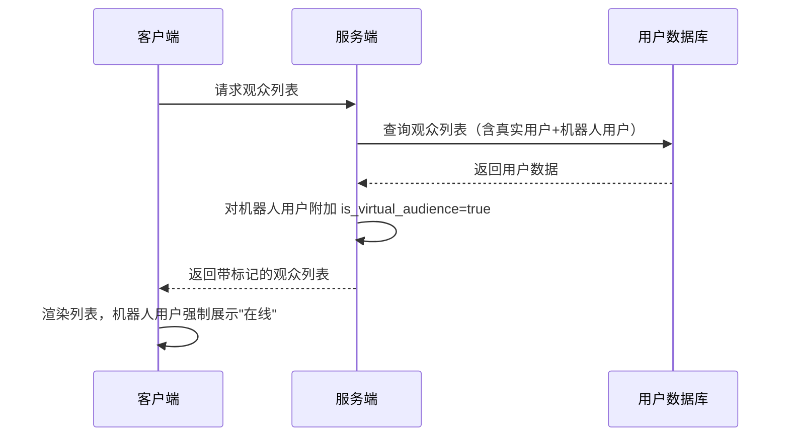

# 直播-观众列表-机器人用户信息展示优化260714

## 一、需求背景

### 1.1 现状与问题

Party 房间及其他直播场景中，系统会从近5天未登录的真实用户中抽取账号作为机器人填充观众列表。当用户点击这些"观众"的主页时，会看到"5天前登录"等真实登录时间，与其"正在观看直播"的在线状态明显矛盾，暴露机器人身份，影响用户对房间热度的信任感。

**需求来源：** [需求卡片：Party房间机器人用户信息展示优化](https://uf1iawhques.sg.larksuite.com/docx/UOJldBU8jovGrDx1DATlZ4Qbgqc)

### 1.2 目标

> **核心目标：** 消除机器人用户信息展示中的逻辑矛盾，使虚拟观众的在线状态和登录时间展示自洽，不暴露机器人身份。

### 1.3 关键指标

| 指标 | 当前值 | 目标值 | 统计口径 |
|------|--------|--------|----------|
| 机器人身份暴露相关用户反馈 | 存在 | 0 | 用户反馈/客服工单 |

---

## 二、需求说明

### 2.1 功能点：观众列表在线状态覆盖（FUNC-001）

#### 功能描述

用户进入 Party 房间或其他直播间，查看在线观众列表时，系统机器人用户的在线状态统一展示为"在线"，与其出现在观众列表中的身份保持一致。

#### 交互规则

- **触发条件：** `[服务端]` 观众列表接口下发用户数据时，对当前被系统抽取为虚拟观众的用户，附加标记字段 `is_virtual_audience: true`
- **展示位置：** `[客户端]` 观众列表中该用户的在线状态标识
- **展示规则：** `[客户端]` 当用户 `is_virtual_audience=true` 时，在线状态强制展示为"在线"（绿色圆点），忽略真实的 `last_login_time`
- **数据来源：** `[服务端]` 标记基于"当前该用户是否正被用作观众列表填充"的运行时状态判断，不修改用户表的真实登录时间字段
- **生效范围：** `[客户端]` 仅在观众列表场景生效；其他列表（好友列表、搜索结果等）不受影响

#### 异常处理

- **数据为空：** `[客户端]` 若接口未返回 `is_virtual_audience` 字段，按 `false` 处理，展示真实在线状态
- **文本超长：** 不涉及（在线状态为固定图标+固定文案）
- **网络异常：** `[客户端]` 观众列表加载失败时展示通用加载失败提示，支持下拉重试
- **重复操作：** `[客户端]` 观众列表下拉刷新做节流处理，1秒内重复下拉不重新请求

#### 业务流程图

---

### 2.2 功能点：个人主页登录时间覆盖（FUNC-002）

#### 功能描述

用户从观众列表点击机器人用户头像进入其个人主页时，"最近登录时间"展示为"刚刚"，在线状态展示为"在线"，与观众列表中的展示保持一致。仅从观众列表入口进入时生效，其他入口（搜索、好友列表、IM 消息等）进入同一用户主页时展示真实数据。

#### 交互规则

- **触发条件：** `[客户端]` 从观众列表点击用户头像跳转主页时，携带来源参数 `from=audience_list` 及目标用户的 `is_virtual_audience` 标记
- **展示位置：** `[客户端]` 个人主页的"最近登录时间"字段和在线状态标识
- **展示规则：** `[客户端]` 当来源为观众列表（`from=audience_list`）且该用户 `is_virtual_audience=true` 时：
  - "最近登录时间"展示为"刚刚"
  - 在线状态展示为"在线"（绿色圆点）
- **非观众列表入口：** `[客户端]` 若用户通过搜索、好友列表、IM 聊天、分享链接等其他入口进入同一用户主页，不携带观众列表来源参数，展示真实的登录时间和在线状态
- **数据不落地：** `[客户端]` 覆盖逻辑仅影响当次展示，不缓存、不写入本地数据库，返回列表或切换入口后恢复真实数据

#### 异常处理

- **数据为空：** `[客户端]` 若主页接口返回的登录时间为空，展示为"刚刚"（与覆盖逻辑一致，无矛盾）
- **文本超长：** `[客户端]` "刚刚"为固定文案，不存在超长问题；真实时间展示按现有截断规则处理
- **网络异常：** `[客户端]` 主页加载失败时展示通用错误页，支持点击重试；重试时保留来源参数
- **重复操作：** `[客户端]` 主页加载请求做防重处理，连续快速点击同一头像只发起一次请求
- **机器人用户恰好真实在线：** `[客户端]` 此时真实数据本身就是"在线/刚刚"，覆盖逻辑等于无操作，无冲突
- **用户对机器人发起互动（关注/私信）：** `[客户端+服务端]` 正常执行，不拦截。目标账号为真实用户，消息/关注关系正常生效，对方下次登录可见

---

## 三、设计稿

> 设计稿完成后在此补充链接。

---

## 四、多语言Key

| 是否APP端 | Key | 中文 |
|-----------|-----|------|
| 是 | user_status_online | 在线 |
| 是 | user_login_time_just_now | 刚刚 |
